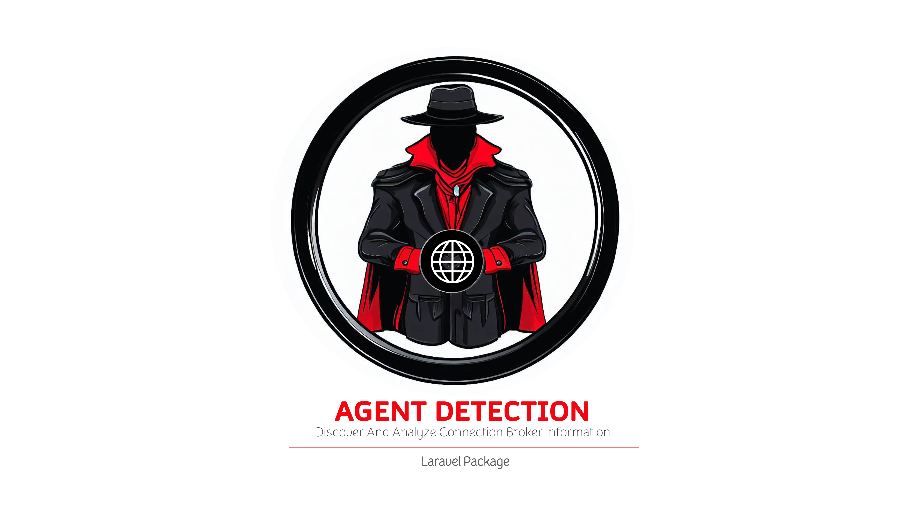

# Agent Detection | Discovery and Analysis of Connection Agent Information

The `Agent Detection` library offers a wide range of methods that allow you to discover and analyze connection agent information in your application.

⚙️ This library is compatible with Laravel versions 8.0 and above ⚙️

[](https://laravel.com)
[](https://laravel.com)
[](https://laravel.com)



📖 [**SPANISH DOCUMENTATION**](README_SPANISH.md.md) 📖

## Table of Contents
1. [Installation](#installation)
2. [Introduction](#introduction)
3. [Available Methods](#available-methods)
   - [Get Agent](#get-agent)
   - [Validate if it's a Mobile Connection](#validate-if-its-a-mobile-connection)
   - [Validate if it's a Desktop Connection](#validate-if-its-a-desktop-connection)
   - [Validate if it's an iPhone](#validate-if-its-an-iphone)
   - [Validate if it's a Macintosh](#validate-if-its-a-macintosh)
   - [Validate if it's Linux](#validate-if-its-linux)
   - [Validate if it's Android](#validate-if-its-android)
   - [Validate if it's Windows](#validate-if-its-windows)
   - [Validate if it's a Windows Phone](#validate-if-its-a-windows-phone)
   - [Validate if it's an iPod](#validate-if-its-an-ipod)
   - [Validate if it's an iPad](#validate-if-its-an-ipad)
   - [Validate if it's an iMac](#validate-if-its-an-imac)
   - [Validate if it's a Tablet](#validate-if-its-a-tablet)
   - [Validate if it's a Crawler (Robot)](#validate-if-its-a-crawler-robot)
   - [Validate if Agent Matches an Expression](#validate-if-agent-matches-an-expression)
   - [Validate if Agent Connects from a Specific IP or Port](#validate-if-agent-connects-from-a-specific-ip-or-port)
   - [Get the Client Connection Operating System](#get-the-client-connection-operating-system)
   - [Get Browser Data](#get-browser-data)
   - [Get Robot Data](#get-robot-data)
4. [Creator](#creator)
5. [License](#license)

## Installation
To install the library, you can easily do so through Composer.
```shell
composer require rmunate/agent-detection
```

## Introduction
This simple library allows you to obtain specific details about the connection agent, which will enable you to enhance the user experience based on connection data. For example, if you detect that it's a mobile connection, you can invite the user to download the mobile application if your system has one. Similarly, you can offer a more personalized experience for Android or iPhone users, differentiate options, menus, and other elements between desktop and mobile device users.

This library also leverages the functionality of the package [https://github.com/JayBizzle/Crawler-Detect](https://github.com/JayBizzle/Crawler-Detect), allowing you to determine if it's a bot, crawler, or spider. In summary, you have endless possibilities at your disposal.

## Available Methods
Below are the available methods in the library. Make sure you have the latest version installed in your system to use any of the following methods or directives.

### Get Agent
`Agent::get()` returns the current connection agent detected by the server.

```php
use Rmunate\AgentDetection\Agent;

Agent::get();
//"Mozilla/5.0 (Macintosh; Intel Mac OS X 10_15_7) AppleWebKit/537.36 (KHTML, like Gecko) Chrome/116.0.0.0 Safari/537.36"
```

### Validate if it's a Mobile Connection
You can perform this validation from controllers or directly from the view using the provided Blade directive.

```php
use Rmunate\AgentDetection\Agent;

// Detecting the Current Agent
if (Agent::detect()->isMobile()) {
    # It's a Mobile Connection...
} 

// Assigning a Custom Agent
if (Agent::set("Mozilla/5.0...")->isMobile()) {
    # It's a Mobile Connection...
} 
```

Blade Directive: This directive validates the in-use connection agent and, based on this, acts as a condition.

```php
@ifAgentIsMobile
    <h1>It's a Mobile Connection</h1>
@else
    <h1>It's Not a Mobile Connection</h1>
@endIfAgentIsMobile
```

### Validate if it's a Desktop Connection
You can perform this validation from controllers or directly from the view using the provided Blade directive.

```php
use Rmunate\AgentDetection\Agent;

// Detecting the Current Agent
if (Agent::detect()->isDesktop()) {
    # It's a Desktop Connection...
} 

// Assigning a Custom Agent
if (Agent::set("Mozilla/5.0...")->isDesktop()) {
    # It's a Desktop Connection...
} 
```

Blade Directive: This directive validates the in-use connection agent and, based on this, acts as a condition.

```php
@ifAgentIsDesktop
    <h1>It's a Desktop Connection</h1>
@else
    <h1>It's Not a Desktop Connection</h1>
@endIfAgentIsDesktop
```

### Validate if it's an iPhone

You can perform this validation from controllers or directly from the view using the provided Blade directive.

```php
use Rmunate\AgentDetection\Agent;

// Detecting the Current Agent
if (Agent::detect()->isIPhone()) {
    # It's an iPhone...
} 

// Assigning a Custom Agent
if (Agent::set("Mozilla/5.0...")->isIPhone()) {
    # It's an iPhone...
} 
```

Blade Directive: This directive validates the in-use connection agent and, based on this, acts as a condition.

```php
@ifAgentIsIPhone
    <h1>It's an iPhone</h1>
@else
    <h1>It's Not an iPhone</h1>
@endIfAgentIsIPhone
```

### Validate if it's a Macintosh
You can perform this validation from controllers or directly from the view using the provided Blade directive.

```php
use Rmunate\AgentDetection\Agent;

// Detecting the Current Agent
if (Agent::detect()->isMacintosh()) {
    # It's a Macintosh...
} 

// Assigning a Custom Agent
if (Agent::set("Mozilla/5.0...")->isMacintosh()) {
    # It's a Macintosh...
} 
```

Blade Directive: This directive validates

 the in-use connection agent and, based on this, acts as a condition.

```php
@ifAgentIsMacintosh
    <h1>It's a Macintosh</h1>
@else
    <h1>It's Not a Macintosh</h1>
@endIfAgentIsMacintosh
```

### Validate if it's Linux
You can perform this validation from controllers or directly from the view using the provided Blade directive.

```php
use Rmunate\AgentDetection\Agent;

// Detecting the Current Agent
if (Agent::detect()->isLinux()) {
    # It's Linux...
} 

// Assigning a Custom Agent
if (Agent::set("Mozilla/5.0...")->isLinux()) {
    # It's Linux...
} 
```

Blade Directive: This directive validates the in-use connection agent and, based on this, acts as a condition.

```php
@ifAgentIsLinux
    <h1>It's Linux</h1>
@else
    <h1>It's Not Linux</h1>
@endIfAgentIsLinux
```

### Validate if it's Android
You can perform this validation from controllers or directly from the view using the provided Blade directive.

```php
use Rmunate\AgentDetection\Agent;

// Detecting the Current Agent
if (Agent::detect()->isAndroid()) {
    # It's Android...
} 

// Assigning a Custom Agent
if (Agent::set("Mozilla/5.0...")->isAndroid()) {
    # It's Android...
} 
```

Blade Directive: This directive validates the in-use connection agent and, based on this, acts as a condition.

```php
@ifAgentIsAndroid
    <h1>It's Android</h1>
@else
    <h1>It's Not Android</h1>
@endIfAgentIsAndroid
```

### Validate if it's Windows
You can perform this validation from controllers or directly from the view using the provided Blade directive.

```php
use Rmunate\AgentDetection\Agent;

// Detecting the Current Agent
if (Agent::detect()->isWindows()) {
    # It's Windows...
} 

// Assigning a Custom Agent
if (Agent::set("Mozilla/5.0...")->isWindows()) {
    # It's Windows...
} 
```

Blade Directive: This directive validates the in-use connection agent and, based on this, acts as a condition.

```php
@ifAgentIsWindows
    <h1>It's Windows</h1>
@else
    <h1>It's Not Windows</h1>
@endIfAgentIsWindows
```

### Validate if it's a Windows Phone
You can perform this validation from controllers or directly from the view using the provided Blade directive.

```php
use Rmunate\AgentDetection\Agent;

// Detecting the Current Agent
if (Agent::detect()->isWindowsPhone()) {
    # It's a Windows Phone...
} 

// Assigning a Custom Agent
if (Agent::set("Mozilla/5.0...")->isWindowsPhone()) {
    # It's a Windows Phone...
} 
```

Blade Directive: This directive validates the in-use connection agent and, based on this, acts as a condition.

```php
@ifAgentIsWindowsPhone
    <h1>It's a Windows Phone</h1>
@else
    <h1>It's Not a Windows Phone</h1>
@endIfAgentIsWindowsPhone
```

### Validate if it's an iPod
You can perform this validation from controllers or directly from the view using the provided Blade directive.

```php
use Rmunate\AgentDetection\Agent;

// Detecting the Current Agent
if (Agent::detect()->isIpod()) {
    # It's an iPod...
} 

// Assigning a Custom Agent
if (Agent::set("Mozilla/5.0...")->isIpod()) {
    # It's an iPod...
} 
```

Blade Directive: This directive validates the in-use connection agent and, based on this, acts as a condition.

```php
@ifAgentIsIpod
    <h1>It's an iPod</h1>
@else
    <h1>It's Not an iPod</h1>
@endIfAgentIsIpod
```

### Validate if it's an iPad
You can perform this validation from controllers or directly from the view using the provided Blade directive.

```php
use Rmunate\AgentDetection\Agent;

// Detecting the Current Agent
if (Agent::detect()->isIpad()) {
    # It's an iPad...
} 

// Assigning a Custom Agent
if (Agent::set("Mozilla/5.0...")->isIpad()) {
    # It's an iPad...
} 
```
Blade Directive: This directive validates the in-use connection agent and, based on this, acts as a condition.

```php
@ifAgentIsIpad
    <h1>It's an iPad</h1>
@else
    <h1>It's Not an iPad</h1>
@endIfAgentIsIpad
```

### Validate if it's an iMac
You can perform this validation from controllers or directly from the view using the provided Blade directive.

```php
use Rmunate\AgentDetection\Agent;

// Detecting the Current Agent
if (Agent::detect()->isIMac()) {
    # It's an iMac...
} 

// Assigning a Custom Agent
if (Agent::set("Mozilla/5.0...")->isIMac()) {
    # It's an iMac...
} 
```

Blade Directive: This directive validates the in-use connection agent and, based on this, acts as a condition.

```php
@ifAgentIsIMac
    <h1>It's an iMac</h1>
@else
    <h1>It's Not an iMac</h1>
@endIfAgentIsIMac
```

### Validate if it's a Tablet
You can perform this validation from controllers or directly from the view using the provided Blade directive.

```php
use Rmunate\AgentDetection\Agent;

// Detecting the Current Agent
if (Agent::detect()->isTablet()) {
    # It's a Tablet...
} 


// Assigning a Custom Agent
if (Agent::set("Mozilla/5.0...")->isTablet()) {
    # It's a Tablet...
} 
```

Blade Directive: This directive validates the in-use connection agent and, based on this, acts as a condition.

```php
@ifAgentIsTablet
    <h1>It's a Tablet</h1>
@else
    <h1>It's Not a Tablet</h1>
@endIfAgentIsTablet
```

### Validate if it's a Crawler (Robot)
You can perform this validation from controllers or directly from the view using the provided Blade directive.
You can use `isCrawler()` or `isRobot()`

```php
use Rmunate\AgentDetection\Agent;

// Detecting the Current Agent
if (Agent::detect()->isCrawler()) { // Agent::detect()->isRobot()
    # It's a Crawler (Robot)...
} 

// Assigning a Custom Agent
if (Agent::set("User-Agent of Crawler")->isCrawler()) { // Agent::set("User-Agent of Crawler")->isRobot()
    # It's a Crawler (Robot)...
} 
```
Blade Directive: This directive validates the in-use connection agent and, based on this, acts as a condition.

```php
@ifAgentIsCrawler //@ifAgentIsRobot
    <h1>It's a Crawler (Robot)</h1>
@else
    <h1>It's Not a Crawler (Robot)</h1>
@endIfAgentIsCrawler //@endIfAgentIsRobot
```

### Validate if the Agent Matches an Expression
You can perform this custom validation using the `match($expression)` method from controllers or directly from the view using the provided Blade directive.

```php
use Rmunate\AgentDetection\Agent;

// Detecting the Current Agent 
if (Agent::detect()->match('Firefox')) {
    # The Agent contains the expression...
} 

// Assigning a Custom Agent
if (Agent::set("Custom User-Agent")->match('Firefox')) {
    # The Agent contains the expression...
} 
```

Blade Directive: This directive validates the in-use connection agent contains a custom expression, and based on this, acts as a condition.

```php
@ifAgentMatch('Firefox')
    <h1>The Agent contains the expression</h1>
@else
    <h1>The Agent does not contain the expression</h1>
@endIfAgentMatch
```

### Validate if the Agent Connects from a Specific IP or Port
To obtain the source IP address of the request, you can use the following PHP code:

```php
use Rmunate\AgentDetection\Agent;

$ip = Agent::remoteAddress(); //'127.0.0.1'
$port = Agent::remotePort(); //55660
```

Blade Directive: This directive validates if the request comes from a specific IP.

```php
@ifAgentRemoteIp('127.0.0.1')
    <h1>Authorized IP</h1>
@else
    <h1>Unauthorized IP</h1>
@endIfAgentRemoteIp
```

Blade Directive: This directive validates if the request comes from a specific port.
```php
@ifAgentRemotePort('55660')
    <h1>Authorized Port</h1>
@else
    <h1>Unauthorized Port</h1>
@endIfAgentRemotePort
```

### Get the Client Connection's Operating System
To obtain the name of the client connection's operating system, you can use the following method:

```php
use Rmunate\AgentDetection\Agent;

$os = Agent::detect()->clientOS(); // Mac | Windows...
// It will return the name of the operating system
```

### Get Browser Data
To obtain browser data from the client connection, you can use the following PHP method:

```php
use Rmunate\Server\Agent;

$browser = Agent::detect()->browser();
```
This code will return an array with information about the browser, including the browser name, version, and platform. For example:

```php
array:3 [▼
   "name" => "Apple Safari"
   "version" => "537.36"
   "platform" => "Macintosh"
]
```

### Get Robot Data
To obtain data about any robot that may exist within the client connection, you can use the following PHP method:

```php
use Rmunate\Server\Agent;

//$robotData = $agente = Agent::intersect()->getIfIsCrawler();
//null

$robotData = $agente = Agent::set('Mozilla/5.0 (compatible; Sosospider/2.0; +http://help.soso.com/webspider.htm)')->getIfIsCrawler();
// "Sosospider"

```

## Creator
- 🇨🇴 Raúl Mauricio Uñate Castro
- Email: raulmauriciounate@gmail.com

## License
This project is under the [MIT License](https://choosealicense.com/licenses/mit/).

🌟 Support My Projects! 🚀

Make whatever contributions you see fit; the code is entirely yours. Together, we can do amazing things and improve the world of development. Your support is invaluable. ✨

If you have ideas, suggestions, or just want to collaborate, we're open to it all! Join our community and be part of our journey to success! 🌐👩‍💻👨‍💻